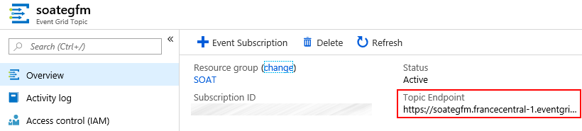

# Instructions

## Enregistrement du provider Event Grid

Sur le portail Azure, dans la blade **Subscriptions > Resource providers** recherchez puis activez le provider **Microsoft.EventGrid**


## Création du Custom Topic

Créez la ressource Azure suivante :

- Event Grid Topic

## Déploiement de l'Event Grid Viewer

Nous allons déployer une application web (Event Grid Viewer) qui va jouer le rôle du handler.

<a href="https://portal.azure.com/#create/Microsoft.Template/uri/https%3A%2F%2Fraw.githubusercontent.com%2FAzure-Samples%2Fazure-event-grid-viewer%2Fmaster%2Fazuredeploy.json" target="_blank"></a>

## S'abonner au Custom Topic

Ajoutez une nouvelle **Event Subscription**.


- **Endpoint Type :** Web Hook

- **Endpoint :** https://**[web-app-name]**.azurewebsites.net/api/updates


## Test

Avant de tester, il faut réupérer :

- **Endpoint du Topic**



- **Clé**


Afin de tester notre Cusom Topic, nous pouvons utiliser Postman pour envoyer un évènement à Event Grid :

- Dans la section header, il faut ajouter la clé : **aeg-sas-key**


- Dans la section body, il faut ajouter les détails de l'évènement à envoyer :

```json
[{
  "id": "1111",
  "eventType": "soatTest",
  "subject": "soat/techlab/demo",
  "eventTime": "2018-12-12T00:00:00+00:00",
  "data": {
    "name": "Serveless Eventing avec Azure Event Grid",
    "type": "Techlab"
  },
  "dataVersion": "1.0"
}]
```


Une fois la requête envoyée, nous pouvons voir les détails de l'évènement dans l'application web :

