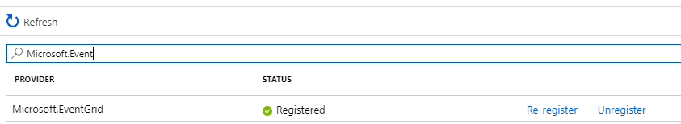
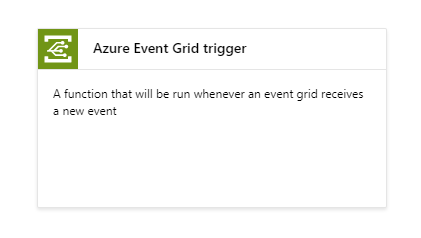
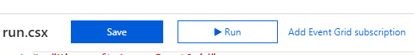
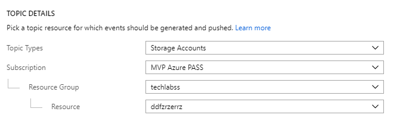
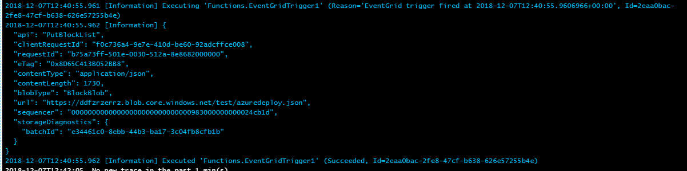

# Instructions

## Enregistrement du provider Event Grid

Sur le portail Azure, dans la blade **Subscriptions > Resource providers** recherchez puis activez le provider **Microsoft.EventGrid**

## Création des ressources

Créez les ressources Azure suivantes :

- Storage Accounts de type **StorageV2**, **Hot**
- Azure Function

## Azure Function

Via le portail Azure, créez une Azure Function de type **Azure Event Grid Trigger**

Configurez votre Event Grid via le bouton disponible dans le portail d'édition d'Azure Function

Configurer votre Event Grid de la manière suivante : 

Ouvrez la console de Log de votre Azure Function, et dans une autre fenêtre ajouter un Blob à votre compte de stockage.

Votre fonction sera déclenché à chaque ajout ou suppression de Blob