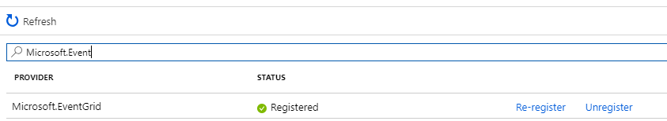

# Instructions

## Enregistrement du provider Event Grid

Sur le portail Azure, dans la blade **Subscriptions > Resource providers** recherchez puis activez le provider **Microsoft.EventGrid**

## Logic Apps

Créer un nouveau service de type **Logic App** en **West Europe**

Allez sur votre Logic App fraichement créé et sélectionnez le type **When an Event Grid resource event occurs**

Connectez-vous à votre souscription avec un compte **Owner**

Remplissez les champs suivants : 

- Subscription : **Nom de votre souscription**
- Resource Type : **Microsoft.Resources.Subscriptions**
- Resource Name : **Nom de votre souscription**

Créer un nouvel élément de type Mail (Office 365, Gmail, Outlook, ....) et renseignez les différents champs dans le body du mail. 

Sauvegarder votre Logic App, puis appuyez sur le bouton **Run**. 

## Test

Créer une ressource sur Azure, comme un resource group, et normalement vous recevrez un mail (voir même plusieurs)

## Vérification

Sur le portail Azure, dans la blade **Event Subscriptions** il est possible de voir votre topic.

